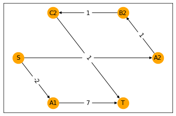
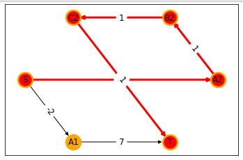
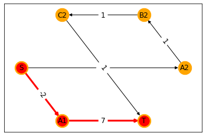

# networkx-astar-path


Alternative A* implementation, which provides the current and previous edge to the weight function.

## Requirements

* Python 3.6.1 or newer
* [poetry](https://poetry.eustance.io/) 1.1 or newer

## Usage

networkx's implementation of A* limit the arguments of the weight function to the current edge onlye.
Some scenarious require that the cost for the current edge is dependent on the prevous edge.
An example is the bearing between two edges.
Surely, the bearing could be pre-calculate and stored on the node, but this is sometimes not possible.

The API of this implementation is the same, with the one exception that the weight-funciton signature has changed to

```python
def weight(graph: nx.Graph, prev_edge: Optional[Tuple[Any, Any]], cur_edge: Tuple[Any, Any]) -> float:
    ...
```

If the weight-function is called for the first time, the value for `prev_edge` is `None` as we haven't visited any other edge yet.

### Example

> **NOTE** This example is not very practical, but shows how this function can be used.

Given the following graph



```python
import networks as nx

G = nx.DiGraph()

G.add_edges_from([('S', 'A1')], weight=-2)
G.add_edges_from([('A1', 'T')], weight=7)
G.add_edges_from([('S','A2'), ('A2','B2'),('B2','C2'),('C2','T')], weight=1)
```


we are searching for the shortest path from `S` to `T`.

> The [weights have been chosen](https://www.wolframalpha.com/input/?i=x%2By%2Bz+%3C+a+%2B+b%3B+x+%2B+y%2Fx+%2B+z%2Fy+%3E+a+%2B+b%2Fa%3B++x%3D1%2C+y%3D1%2C+z%3D) in a way that the path `['S', 'A2', 'B2', 'C2', 'T']` is shorter when we simply sum up the weights, but longer if the weight of the current edge is divided by the weight of the previous edge.
The shortest path for the latter is `['S', 'A1', 'T']`.

Let's find the shortest path by only looking at the weights of the current edge.

```python
from networkx_astar_path import astar_path

path = astar_path(G, source='S', target='T', weight="weight")
# ['S', 'A2', 'B2', 'C2', 'T']
```



We now define a "simple" weight function, which takes the previous edge into account:

> If we already visited an edge, the weight is the weight of the current edge divided by the weight of the previous edge.
> Otherwise, the weight of the current edge is returned.

```python
from networkx_astar_path import astar_path

def dependent_weight(graph: nx.Graph, prev_edge: Optional[Tuple[Any, Any]], cur_edge: Tuple[Any, Any]) -> float:
    if prev_edge is None:
        return graph.get_edge_data(*cur_edge)['weight']

    prev_weight = graph.get_edge_data(*prev_edge)['weight']
    cur_weight = graph.get_edge_data(*cur_edge)['weight']
    return cur_weight / prev_weight

path = astar_path(G, source='S', target='T', weight=dependent_weight)
# ['S', 'A1', 'T']
```



## Development

This project uses [poetry](https://poetry.eustace.io/) for packaging and
managing all dependencies and [pre-commit](https://pre-commit.com/) to run
[flake8](http://flake8.pycqa.org/), [isort](https://pycqa.github.io/isort/),
[mypy](http://mypy-lang.org/) and [black](https://github.com/python/black).

Clone this repository and run

```bash
poetry install
poetry run pre-commit install
```

to create a virtual enviroment containing all dependencies.
Afterwards, You can run the test suite using

```bash
poetry run pytest
```

This repository follows the [Conventional Commits](https://www.conventionalcommits.org/)
style.

### Cookiecutter template

This project was created using [cruft](https://github.com/cruft/cruft) and the
[cookiecutter-pyproject](https://github.com/escaped/cookiecutter-pypackage) template.
In order to update this repository to the latest template version run

```sh
cruft update
```

in the root of this repository.

